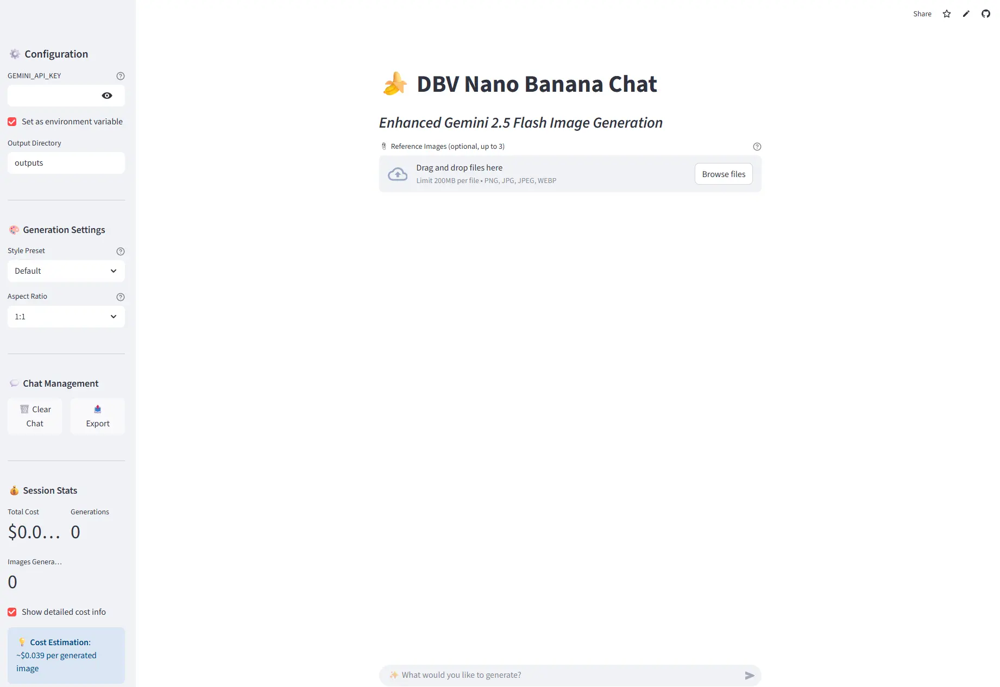

# Interfaz Streamlit para DBV-Nano-Banana

Este proyecto ofrece una interfaz web amigable desarrollada con Streamlit para la herramienta DBV-Nano-Banana. Permite a los usuarios interactuar con las potentes funciones de Nano Banana simplemente proporcionando una API Key de Gemini para empezar a funcionar.


## Características

- **Interfaz Gráfica Intuitiva**: Creado con Streamlit para una experiencia de usuario sencilla y directa.
- **Fácil Configuración**: No requiere complejas instalaciones. Solo introduce tu API Key de Gemini y estarás listo.
- **Procesamiento de Imágenes**: Aprovecha el poder de los modelos de Gemini para analizar y procesar imágenes.
- **Generación de Contenido**: Capacidad para generar respuestas y análisis basados en las imágenes proporcionadas.

## Nueva Versión Chat: DBV_Nano_Banana_Streamlit_Chat.py

Además de la aplicación original, se ha añadido una versión mejorada con funcionalidades de chat que enriquecen la interacción:

- **Sesión de Chat Persistente**: Mantén una conversación fluida y coherente.
- **Estilos Predefinidos**: Selecciona entre varios estilos visuales para personalizar la experiencia.
- **Ajuste de Imagen**: Cambia el aspect ratio de las imágenes generadas.
- **Exportar Conversación**: Guarda una copia de tu chat.
- **Métricas de Interacción**: Calcula el total de interacciones durante la sesión.

Aunque la versión de chat es más potente, ambas aplicaciones se mantienen disponibles.

## Requisitos

- Python 3.7+
- Pip

## Probarla sin instalarla
Puedes probar la aplicación en los servidores de StreamLit [dbv-nano-banana.streamlit.app](https://dbv-nano-banana.streamlit.app/)
([dbv-nano-banana-chat.streamlit.app](https://dbv-nano-banana-chat.streamlit.app/)
## Instalación

Sigue estos pasos para poner en marcha la aplicación en tu entorno local:

1.  **Clona el repositorio:**
    ```bash
    git clone https://github.com/tu-usuario/DBV-Nano-Banana.git
    cd DBV-Nano-Banana
    ```
    *(Recuerda reemplazar `tu-usuario` con tu nombre de usuario de GitHub)*

2.  **Crea y activa un entorno virtual:**
    ```bash
    # Crear el entorno
    python -m venv venv

    # Activar en Windows
    .\venv\Scripts\activate

    # Activar en macOS/Linux
    source venv/bin/activate
    ```

3.  **Instala las dependencias:**
    ```bash
    pip install -r requirements.txt
    ```

## Uso

Puedes ejecutar cualquiera de las dos aplicaciones disponibles.

1.  **Para la aplicación original:**
    ```bash
    streamlit run DBV_Nano_Banana_Streamlit.py
    ```

2.  **Para la nueva versión con chat:**
    ```bash
    streamlit run DBV_Nano_Banana_Streamlit_Chat.py
    ```

3.  **Introduce tu API Key:**
    La aplicación se abrirá en tu navegador. Lo primero que verás es un campo para introducir tu `API_KEY_GEMINI`. Pégala ahí para desbloquear toda la funcionalidad.

## Licencia

Este proyecto está bajo la Licencia MIT. Consulta el archivo `LICENSE` para más detalles.

## Referencias
 - [Referencia de Gemini para Generación de Imágenes](https://ai.google.dev/gemini-api/docs/image-generation)
- [Google Colab con ejemplos de uso](https://colab.research.google.com/github/google-gemini/cookbook/blob/main/quickstarts/Image_out.ipynb#scrollTo=wnwSzvCTltWd)

## Autores

This project was brought to life by:

*   **David Bueno Vallejo**
    *   **LinkedIn:** [`linkedin.com/in/davidbueno`](https://www.linkedin.com/in/davidbueno/)
    *   **Website:** [`davidbuenov.com`](https://davidbuenov.com)

*   **Chat GPT 5**
   
    *   La estructura, el código y las funcionalidades de esta aplicación web fueron generados con la asistencia de los modelos de Chat GPT 5 desarrollados por OpenAI.

           **Más información:** [`openai.com`](https://openai.com/)

*   **Claude Sonnet 4.0**
   
    *   La nueva versión de chat fue generada con la asistencia de los modelos de Claude Sonnet 4.0.

*   **Gemini**
   
    *   Soporte en la integración de Visual Studio.